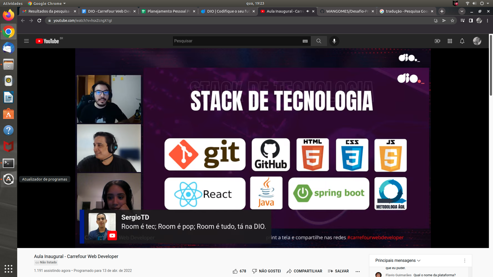

# Desafio Projeto Git/Github DIO
Repositório para o Desafio DIO Git/Github 
Bootcamp Carrefour Web Developer

### Conquistas :trophy: :
 - Pensamento Computacional
 - Lógica de Programação Essencial
 - Introdução ao Git e ao Github
 - Projetos ágeis com o SCRUM
 - Criando seu Primeiro Repositório no GitHub para compartilhar Seu Progresso

### Próximos passos:
 - Modulo II - HTML / CSS3;
 - Módulo III - Javascript;
 - Modulo IV - React;
 - Módulo V - Java / SpringBoot.

## Aula inaugural:

